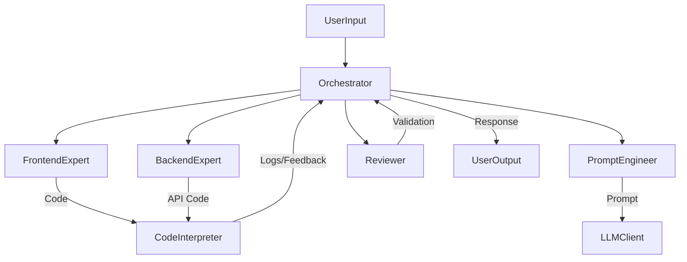

# Viber

## Overview
Viber is an experimental multi-agent platform designed to showcase advanced orchestration patterns across shared frontend, backend, and sandbox environments. The repository is organized as a Turborepo/Nx-style monorepo, enabling rapid iteration and code sharing between agents, UI primitives, and execution environments.

## Directory Structure
```
/ai-agent-platform/
│
├── apps/
│   ├── web/                     # Next.js 15+ app, SSR/ISR, streaming routes, frontend UI
│   └── sandbox/                 # WebContainer backend (e.g. StackBlitz/Cloudflare Sandboxes)
│
├── packages/
│   ├── agent-core/              # Agent orchestration, roles, prompt templates
│   ├── agent-llm/               # Vercel AI SDK setup, Gemini/OpenAI provider clients
│   ├── ui/                      # shadcn/ui components (shared)
│   ├── codemirror/              # CodeMirror React wrapper, custom extensions
│   └── types/                   # Shared TypeScript types, Zod schemas
│
├── prisma/                      # Database schema for task/memory persistence
├── docs/                        # Documentation (Markdown, Mermaid, code samples)
├── .github/
├── .env.example
├── package.json
└── turbo.json / nx.json         # Monorepo tools (Turborepo/Nx)
```

## Agent Roles and Responsibilities
- **Orchestrator ("Parent")** – Coordinates specialized agents based on user input and intent routing.
- **Frontend Expert** – Delivers UI/UX, React, and Next.js implementations using the shared design system.
- **Backend Expert** – Provides API, database, and integration logic aligned with Prisma schemas.
- **Code Interpreter** – Executes and debugs code in secure sandboxes such as WebContainer.
- **Prompt Engineer** – Crafts and refines system/user prompts for optimal model performance.
- **Data/RAG Agent** – Retrieves contextual data using embeddings and hybrid semantic search.
- **Reviewer/Validator** – Performs linting, testing, and quality enforcement before deployment.
- **SEO/Compliance Agent** – Guarantees adherence to SEO best practices and policy constraints.

## Orchestration Flow


## Getting Started
1. Install dependencies with `pnpm install` (recommended for Turborepo/Nx workspaces).
2. Copy `.env.example` to `.env` and populate provider keys for your LLM and vector store integrations.
3. Use `pnpm dev --filter apps/web` to run the Next.js application and `pnpm dev --filter apps/sandbox` to start the sandbox environment when needed.
4. Leverage shared packages from `packages/` to ensure consistent types, UI components, and orchestration logic across the monorepo.

## Contribution Guidelines
- Maintain zero-placeholder code and follow the Geist design system for UI contributions.
- Ensure accessibility, performance, and security standards for every change.
- Validate agent workflows with integration tests and sandbox executions prior to submitting pull requests.

## License
This project is released under the MIT License.
